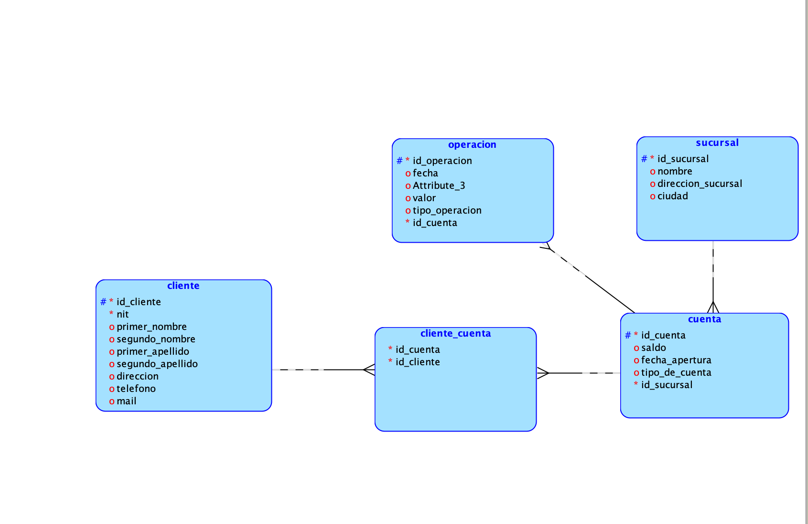
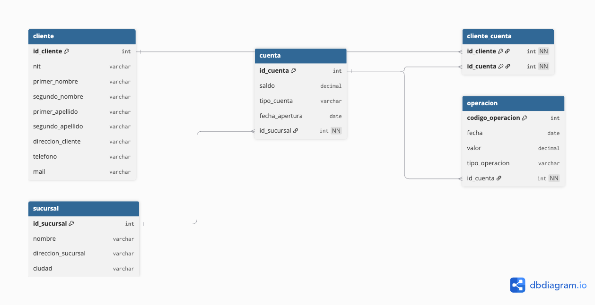

# Caso de estudio – Actividad en clase  
## Modelo para entidad financiera

---

## ACTIVIDAD

Se requiere diseñar un modelo para una entidad financiera que contenga la información de sus **clientes**, las **cuentas bancarias** de sus clientes y las **operaciones** que los clientes realizan en cada una de sus cuentas bancarias.

---

## Reglas de negocio

- Las operaciones se identifican por un **código**.
- Cada operación tiene una **fecha**, un **tipo de operación** (Depósito o Retiro) y un **valor**.
- Un cliente puede tener **varias cuentas**.
- Una cuenta puede tener **varios clientes**.
- Una cuenta pertenece **solo a una sucursal** de la entidad financiera.

---

## Actividades realizadas

### 1. Entidades del caso de estudio

- **Cliente**: persona que mantiene relación con la entidad financiera.
- **Cuenta**: cuenta bancaria asociada a uno o más clientes.
- **Operación**: movimiento (depósito o retiro) realizado sobre una cuenta.
- **Sucursal**: oficina de la entidad financiera a la que pertenece la cuenta.

### 2. Atributos de cada entidad

| Entidad   | Atributos |
|----------|-----------|
| Cliente  | id_cliente, NIT, primer_nombre, segundo_nombre, primer_apellido, segundo_apellido, direccion_cliente, telefono, mail |
| Sucursal | id_sucursal, nombre, direccion_sucursal, ciudad |
| Cuenta   | id_cuenta, saldo, tipo_cuenta, fecha_apertura, id_sucursal |
| Operación| codigo_operacion, fecha, valor, tipo_operacion, id_cuenta |

### 3. Atributos clave de cada entidad

- **Cliente**: `id_cliente` (clave primaria).
- **Sucursal**: `id_sucursal` (clave primaria).
- **Cuenta**: `id_cuenta` (clave primaria).
- **Operación**: `codigo_operacion` (clave primaria).
- **Cliente–Cuenta** (tabla asociativa): clave compuesta `(id_cliente, id_cuenta)`.

### 4. Relaciones y cardinalidad

- **Cuenta – Sucursal**: una cuenta pertenece a una sucursal (N:1).
- **Operación – Cuenta**: una operación pertenece a una cuenta; una cuenta tiene muchas operaciones (N:1).
- **Cliente – Cuenta**: muchos a muchos (M:N) a través de la tabla **Cliente_Cuenta**.

### 5. Diagramas del caso de negocio

A continuación se presentan el **diagrama conceptual**, el **diagrama lógico** y el **diagrama relacional** que representan el caso de negocio. El diagrama lógico fue desarrollado usando Oracle SQL Developer Data Modeler.

---

## Diagrama conceptual

Representación de entidades, atributos y relaciones a nivel conceptual, sin detalles de implementación.

.drawio.png)

---

## Diagrama lógico

Modelo lógico con entidades, atributos, claves y relaciones, listo para transformación a modelo físico.

---

## Diagrama relacional

Modelo relacional con tablas, columnas, claves primarias y foráneas, y tabla asociativa Cliente–Cuenta.

