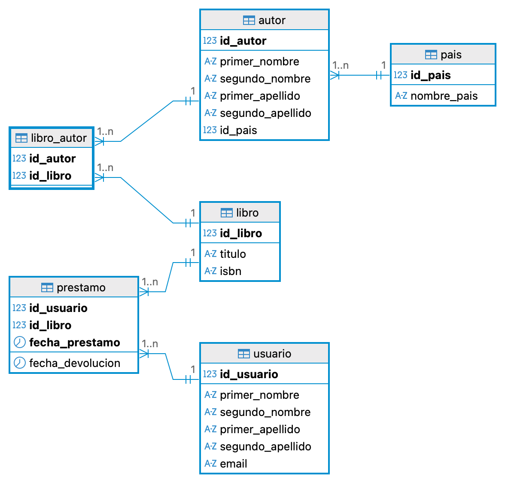

# Sistema de Administración de Biblioteca (SAB) – Modelo de Base de Datos




## Descripción

Este proyecto implementa el **modelo relacional de una base de datos para un sistema de administración de biblioteca**.
El objetivo es gestionar información sobre:

* Países de origen de los autores
* Autores
* Libros
* Usuarios de la biblioteca
* Préstamos de libros

El modelo garantiza **integridad referencial** mediante claves primarias y foráneas, y define restricciones para mantener la consistencia de los datos.

---

# Estructura de la Base de Datos

La base de datos utilizada es:

```
SAB_extendido
```

El sistema está compuesto por las siguientes tablas:

* `pais`
* `autor`
* `libro`
* `libro_autor`
* `usuario`
* `prestamo`

---

# Descripción de las Tablas

## 1. Tabla `pais`

Almacena los países de origen de los autores.

| Campo       | Tipo        | Descripción                  |
| ----------- | ----------- | ---------------------------- |
| id_pais     | INT         | Identificador único del país |
| nombre_pais | VARCHAR(80) | Nombre del país              |

Restricciones:

* `id_pais` es **clave primaria**
* `nombre_pais` es **único**

---

## 2. Tabla `libro`

Contiene la información básica de los libros disponibles en la biblioteca.

| Campo    | Tipo        | Descripción                   |
| -------- | ----------- | ----------------------------- |
| id_libro | INT         | Identificador único del libro |
| titulo   | VARCHAR(60) | Título del libro              |
| isbn     | INT         | Código ISBN del libro         |
| estado   | ENUM        | Estado actual del libro       |

Estados posibles:

```
LIBRE
PRESTADO
MANTENIMIENTO
```

Restricciones:

* `id_libro` es **clave primaria**
* `isbn` es **único**

---

## 3. Tabla `autor`

Almacena la información de los autores.

| Campo            | Tipo        | Descripción              |
| ---------------- | ----------- | ------------------------ |
| id_autor         | INT         | Identificador del autor  |
| primer_nombre    | VARCHAR(20) | Primer nombre del autor  |
| segundo_nombre   | VARCHAR(20) | Segundo nombre           |
| primer_apellido  | VARCHAR(20) | Primer apellido          |
| segundo_apellido | VARCHAR(20) | Segundo apellido         |
| id_pais          | INT         | País de origen del autor |

Relación:

* Un **autor pertenece a un país**

Restricciones:

* `id_autor` es **clave primaria**
* `id_pais` es **clave foránea**

Reglas:

* `ON DELETE RESTRICT`
* `ON UPDATE RESTRICT`

---

## 4. Tabla `libro_autor`

Tabla intermedia que representa la relación **muchos a muchos (N:M)** entre libros y autores.

Un libro puede tener varios autores y un autor puede haber escrito varios libros.

| Campo    | Tipo | Descripción             |
| -------- | ---- | ----------------------- |
| id_autor | INT  | Identificador del autor |
| id_libro | INT  | Identificador del libro |

Restricciones:

* **Clave primaria compuesta:** `(id_autor, id_libro)`
* Ambas columnas son **claves foráneas**

Reglas:

* `ON DELETE CASCADE` para mantener consistencia si se elimina un autor o libro.

---

## 5. Tabla `usuario`

Contiene la información de los usuarios registrados en la biblioteca.

| Campo            | Tipo        | Descripción                    |
| ---------------- | ----------- | ------------------------------ |
| id_usuario       | INT         | Identificador del usuario      |
| primer_nombre    | VARCHAR(20) | Primer nombre                  |
| segundo_nombre   | VARCHAR(20) | Segundo nombre                 |
| primer_apellido  | VARCHAR(20) | Primer apellido                |
| segundo_apellido | VARCHAR(20) | Segundo apellido               |
| email            | VARCHAR(80) | Correo electrónico del usuario |

Restricciones:

* `id_usuario` es **clave primaria**
* `email` es **único**

---

## 6. Tabla `prestamo`

Registra los préstamos de libros realizados por los usuarios.

| Campo            | Tipo     | Descripción                     |
| ---------------- | -------- | ------------------------------- |
| id_usuario       | INT      | Usuario que realiza el préstamo |
| id_libro         | INT      | Libro prestado                  |
| fecha_prestamo   | DATETIME | Fecha y hora del préstamo       |
| fecha_devolucion | DATETIME | Fecha de devolución             |

Características:

* Un usuario puede prestar el mismo libro varias veces en diferentes fechas.

Restricciones:

* **Clave primaria compuesta:** `(id_usuario, id_libro, fecha_prestamo)`
* `id_usuario` es clave foránea hacia `usuario`
* `id_libro` es clave foránea hacia `libro`

Reglas de integridad:

* `ON DELETE RESTRICT` para evitar eliminar usuarios o libros que tengan historial de préstamos.

---

# Relaciones del Modelo

El sistema maneja las siguientes relaciones:

* **Pais 1 → N Autor**
* **Autor N → M Libro** (mediante `libro_autor`)
* **Usuario 1 → N Prestamo**
* **Libro 1 → N Prestamo**

---

# Objetivo del Modelo

Este esquema permite:

* Registrar autores y sus países de origen
* Gestionar libros y sus autores
* Registrar usuarios del sistema
* Controlar préstamos y devoluciones de libros
* Mantener integridad referencial entre las entidades

---

# Tecnologías

* **MySQL**
* **SQL (DDL)**

---

# Autor: Julián Andrés Restrepo

Proyecto desarrollado como ejercicio académico para el diseño de **bases de datos relacionales**.
