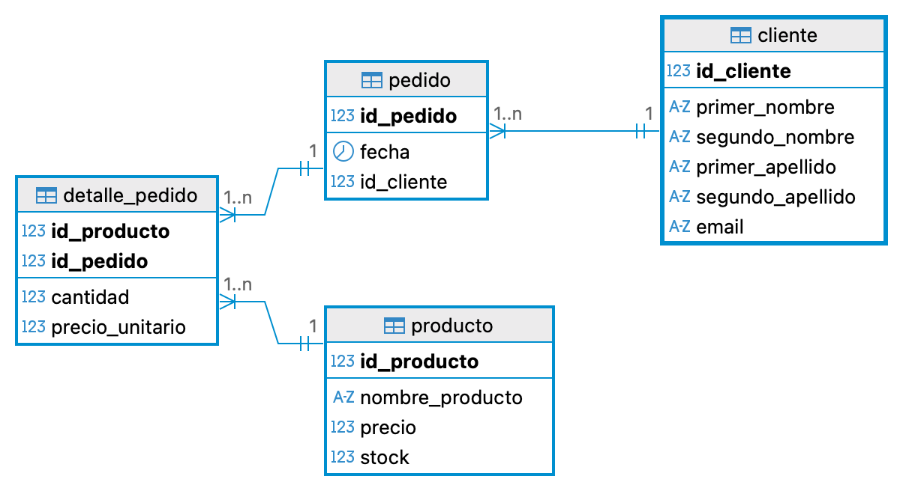

# TechZone – Modelo de Base de Datos

Este proyecto define el modelo relacional de una tienda en línea sencilla llamada **TechZone**.

## Tablas principales

- **cliente**
  - Datos personales del cliente: nombres, apellidos y `email`.
  - `id_cliente` es la clave primaria.
  - `email` es único.

- **producto**
  - Información de cada producto: `nombre_producto`, `precio`, `stock`.
  - `id_producto` es la clave primaria.
  - Restricción `CHECK` para asegurar que `precio >= 0` y `stock >= 0`.

- **pedido**
  - Representa la orden de compra realizada por un cliente.
  - `id_pedido` es la clave primaria.
  - Relación con `cliente`:
    - `id_cliente` es clave foránea que referencia a `cliente(id_cliente)`.
    - `ON DELETE CASCADE`: si se elimina un cliente, se eliminan sus pedidos.

- **detalle_pedido**
  - Tabla intermedia que detalla los productos incluidos en cada pedido.
  - Clave primaria compuesta: (`id_pedido`, `id_producto`).
  - Restricciones:
    - `cantidad > 0`
    - `precio_unitario >= 0`
  - Relaciones:
    - `id_producto` referencia a `producto(id_producto)` con `ON DELETE RESTRICT`.
    - `id_pedido` referencia a `pedido(id_pedido)` con `ON DELETE CASCADE`.

## Relaciones del modelo

- Un **cliente** puede tener **muchos pedidos** (1:N).
- Un **pedido** puede incluir **muchos productos** y un **producto** puede aparecer en **muchos pedidos** (relación N:M resuelta por `detalle_pedido`).

## Modelo lógico (diagrama)

A continuación se incluye la vista del **modelo lógico** de la base de datos:

El archivo del diagrama se encuentra en esta misma carpeta como `TechZone_Diagram.png`.

## Script DDL

El script SQL para crear las tablas y sus restricciones está en:

- `DDL_techZone.sql`