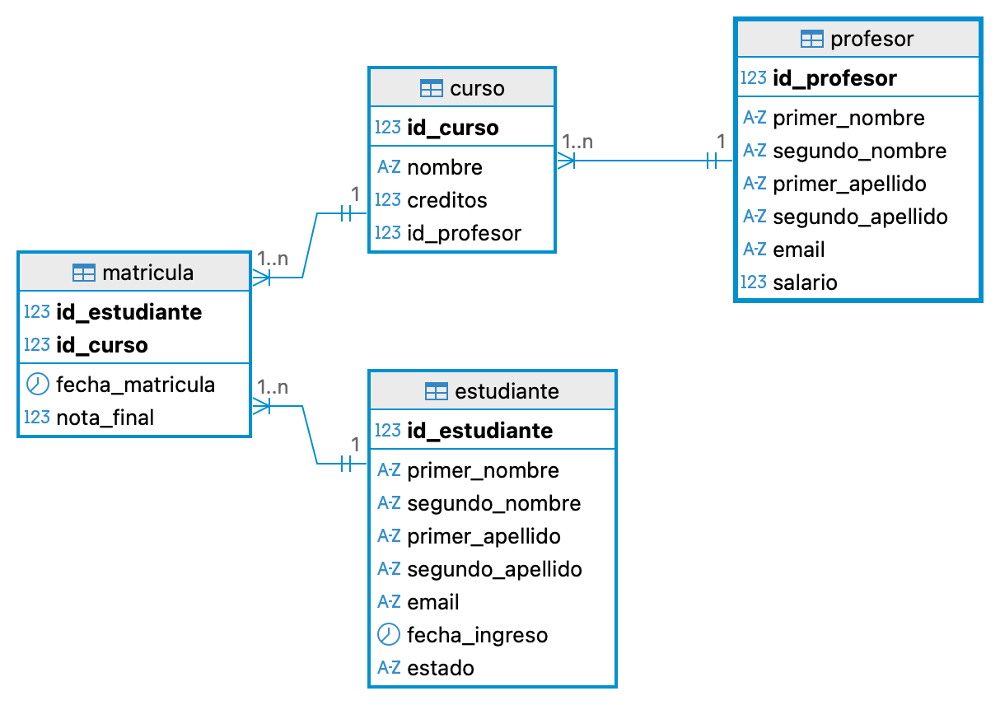

# Sistema Académico Universitario – Modelo de Base de Datos

Este proyecto define el modelo relacional de un **sistema académico universitario** básico.

## Tablas principales

- **estudiante**
  - Información personal del estudiante: nombres, apellidos, `email`.
  - `id_estudiante` es la clave primaria.
  - `email` es único.
  - `fecha_ingreso` almacena la fecha de ingreso.
  - `estado` es un `ENUM("ACTIVO","INACTIVO","GRADUADO")`.

- **profesor**
  - Información personal del profesor: nombres, apellidos, `email`.
  - `id_profesor` es la clave primaria.
  - `email` es único.
  - `salario` con restricción `CHECK (salario > 0)`.

- **curso**
  - Información de cada curso: `nombre`, `creditos`.
  - `id_curso` es la clave primaria.
  - Restricción `CHECK` para que los `creditos` estén entre 1 y 6.
  - Relación con `profesor`:
    - `id_profesor` es clave foránea que referencia a `profesor(id_profesor)`.
    - `ON DELETE RESTRICT`: impide eliminar un profesor si tiene cursos asociados.

- **matricula**
  - Tabla intermedia que registra la inscripción de estudiantes en cursos.
  - Clave primaria compuesta: (`id_estudiante`, `id_curso`).
  - Atributos:
    - `fecha_matricula`
    - `nota_final` con restricción `CHECK (nota_final BETWEEN 0 AND 5)`.
  - Relaciones:
    - `id_estudiante` referencia a `estudiante(id_estudiante)` con `ON DELETE CASCADE`.
    - `id_curso` referencia a `curso(id_curso)` con `ON DELETE CASCADE`.

## Relaciones del modelo

- Un **profesor** puede dictar **muchos cursos** (1:N).
- Un **estudiante** puede inscribirse en **muchos cursos** y un **curso** puede tener **muchos estudiantes** (relación N:M resuelta por `matricula`).

## Modelo lógico (diagrama)

A continuación se incluye la vista del **modelo lógico** de la base de datos:

El archivo del diagrama se encuentra en esta carpeta como `sistema_academico_universitario.png`.

## Script DDL

El script SQL para crear las tablas y sus restricciones está en:

- `DDL_SA_universitario.sql`